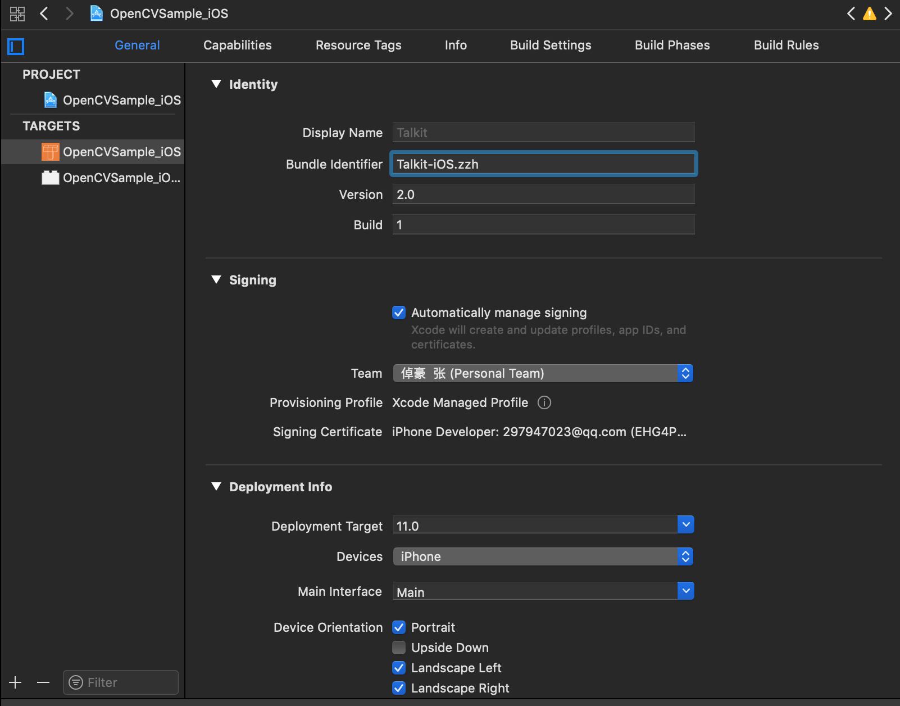
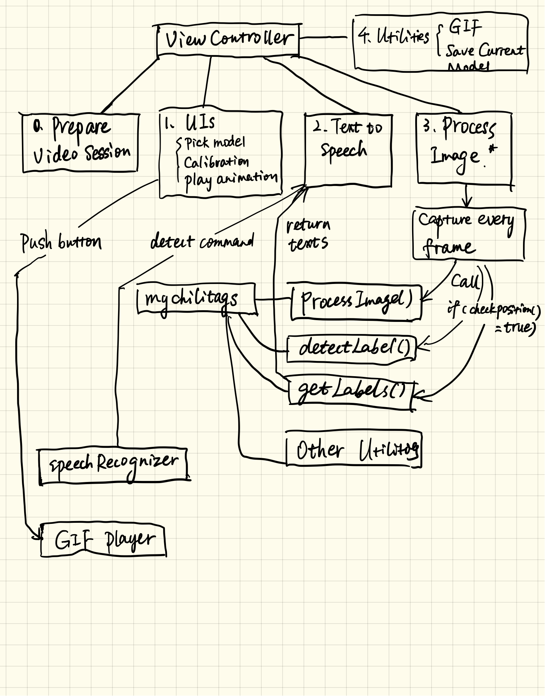

# Talkit++
Talkit++ is an iOS application that plays audio and visual content as a user touches parts of a 3D print. With Talkit++, a visually impaired student can explore a printed model tactilely and use hand gestures and speech commands to get more information about certain elements in the model. Talkit++ detects the model and hand gestures using computer vision algorithms, simple accessories like paper stickers and printable trackers, and the built-in RGB camera on an iOS device. Based on the model’s position and the user’s input, Talkit++ speaks textual information, plays audio recordings, and displays visual animations.

#### Dependencies

You should be using these tools:

1. macOS 10.12.6+
2. Xcode 9.0+
3. iPhone 7, 7p, 8, 8p, X

- iPhone is not necessary to be 7+ now in Phase 1 since we are not using ARkit right now.

#### Install

This project contains the whole Xcode project except for the file `opencv2.framework`(too big to upload).

Here we use OpenCV 3.2.0, you can download it from https://sourceforge.net/projects/opencvlibrary/files/opencv-ios/3.2.0/opencv-3.2.0-ios-framework.zip/download

Then you can put the .framework file in folder `~/OpenCVSample_iOS`.

The project also contains source code from `Chilitags`.

`myChilitags.h` and `myChilitags.mm` are the functions of our own using `OpenCV` and `Chilitags`. They are linked to `ViewController.swift` by the bridging file.

#### Getting Started

After you put .framework file into the correct folder, you can launch the project and run it in your real devices.

Simulator is not recommended because we are using Camera.

If you wish to build a new project from our source code, you need to do those configurations:

1.  Add ` opencv2.framework` in OpenCVSample_iOS > Build Phases > Link Binary With Libraries
2.  Add `$(SRCROOT)/OpenCVSample_iOS/include` in OpenCVSample_iOS > Build Settings > Header Search Paths

* You need to have your Apple Developer Account. Go to General -> Identity -> Bundle Identifier and change the identifier to your own. Then choose the team below as your team.

Then click the Run button and use it!

#### Usage

The application contains 3 main functions:

1. Use camera to capture images, and detect the markers in it
2. Calculate the marker's transform and render the model based on the transform
3. Provide audio feedback and animations for interaction

When you launch the application, you should see a few UIs and a see-through camera interface. Put your interactive 3D models in the range of camera, especially for the 3D marker, and you can see the rendered models. 

Use a finger nailed with red sticker, then point at somewhere on the model. The model will instruct you :)

#### Algorithms and Implementation

Take a look at our structure. Basically we have a `ViewController.swift` as a top layer controlling every component. It contains several modules:

0. Prepare Video Session: In `viewDidLoad()`, you don't need to modify that
1. UIs: model pick, camera calibration, animation playing
2. Text-to-speech: receive texts from lower layers and speak for audio feedback
3. **Process Image: Main function, the application calls `captureOutput()` every video frame, and the function sends each frame to lower levels for processing, then based on the results, the function perform different interactions accordingly** 
   1. The lower level is `myChilitags.mm` and `myChilitags.h`. These codes implemented the image processing functions. They are written in Objective-C
   2. Each frame the `captureOutput()` calls `processImage()`, detect the markers and produce `transformationMatrix` as a result
   3. `detectLabel()` and `getLabels()` are functions that suits our project only. The user points at some area and the function returns the area's label for upper level to speak
4. Utilities: GIF and Save current model, you don't need to modify that
5. SpeechRecognizer and GIF player: They are for specific use and are separately written

So, if you want to use our algorithms, you just need to understand the code and modify the `processImage()` function.

#### Contact

If you have any question in using the project, please contact Zhuohao Zhang (saltfishzzh@gmail.com). He is happy to explain the project to you.	